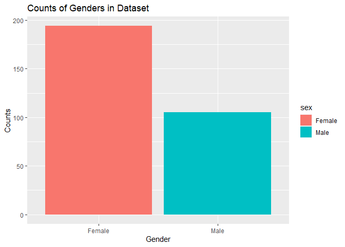
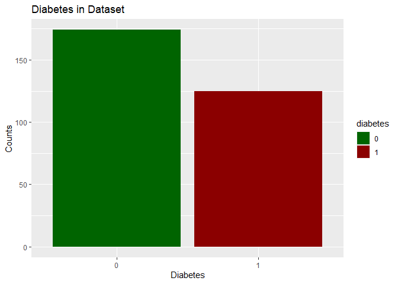
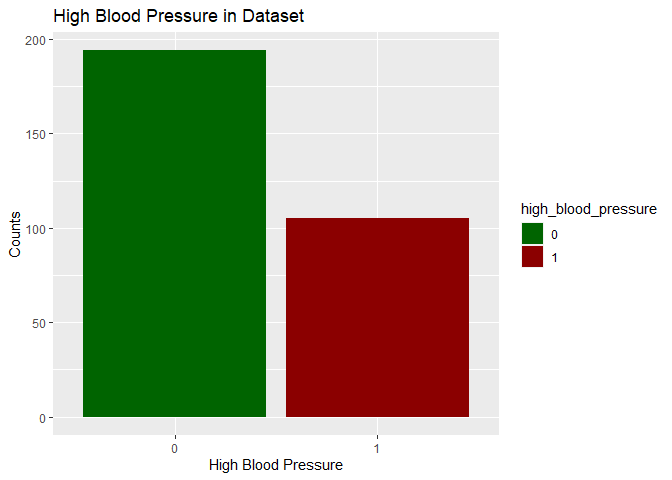
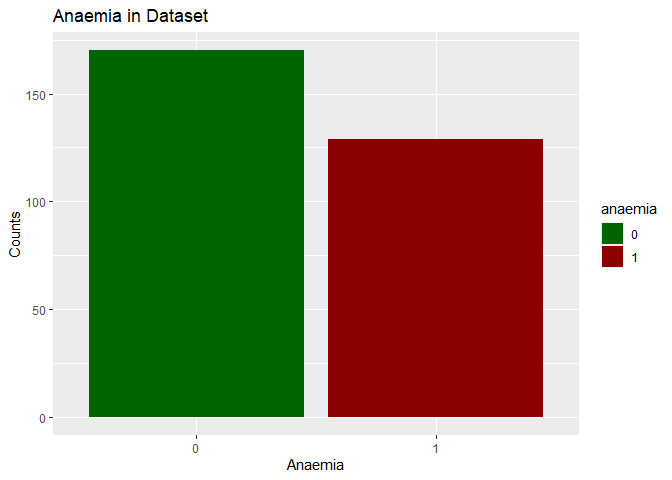

Heart Failure Prediction
================
Tay Yan Jie
3/24/2021

# Load Libraries

``` r
library(tidyverse)
```

    ## -- Attaching packages ---------------------------------------------------------------------------- tidyverse 1.3.0 --

    ## v ggplot2 3.3.2     v purrr   0.3.4
    ## v tibble  3.0.3     v dplyr   1.0.1
    ## v tidyr   1.1.1     v stringr 1.4.0
    ## v readr   1.3.1     v forcats 0.5.0

    ## -- Conflicts ------------------------------------------------------------------------------- tidyverse_conflicts() --
    ## x dplyr::filter() masks stats::filter()
    ## x dplyr::lag()    masks stats::lag()

# Load Data

``` r
data <- read_csv("../heart_failure_clinical_records_dataset.csv")
```

# Data Exploration

``` r
# Convert Categorical Variables to factors
categorical_features <- c("anaemia","diabetes","high_blood_pressure","sex")
data <- data %>% 
  mutate_at(vars(any_of(categorical_features)), as.factor)
summary(data)
```

    ##       age        anaemia creatinine_phosphokinase diabetes ejection_fraction
    ##  Min.   :40.00   0:170   Min.   :  23.0           0:174    Min.   :14.00    
    ##  1st Qu.:51.00   1:129   1st Qu.: 116.5           1:125    1st Qu.:30.00    
    ##  Median :60.00           Median : 250.0                    Median :38.00    
    ##  Mean   :60.83           Mean   : 581.8                    Mean   :38.08    
    ##  3rd Qu.:70.00           3rd Qu.: 582.0                    3rd Qu.:45.00    
    ##  Max.   :95.00           Max.   :7861.0                    Max.   :80.00    
    ##  high_blood_pressure   platelets      serum_creatinine  serum_sodium   sex    
    ##  0:194               Min.   : 25100   Min.   :0.500    Min.   :113.0   0:105  
    ##  1:105               1st Qu.:212500   1st Qu.:0.900    1st Qu.:134.0   1:194  
    ##                      Median :262000   Median :1.100    Median :137.0          
    ##                      Mean   :263358   Mean   :1.394    Mean   :136.6          
    ##                      3rd Qu.:303500   3rd Qu.:1.400    3rd Qu.:140.0          
    ##                      Max.   :850000   Max.   :9.400    Max.   :148.0          
    ##     smoking            time        DEATH_EVENT    
    ##  Min.   :0.0000   Min.   :  4.0   Min.   :0.0000  
    ##  1st Qu.:0.0000   1st Qu.: 73.0   1st Qu.:0.0000  
    ##  Median :0.0000   Median :115.0   Median :0.0000  
    ##  Mean   :0.3211   Mean   :130.3   Mean   :0.3211  
    ##  3rd Qu.:1.0000   3rd Qu.:203.0   3rd Qu.:1.0000  
    ##  Max.   :1.0000   Max.   :285.0   Max.   :1.0000

### Check for missing values:

``` r
any(is.na(data))
```

    ## [1] FALSE

There are no missing values in the Dataset.

## Visualise Categorical Features

### Plot of Genders in Dataset

``` r
data %>%
  mutate(sex=case_when(sex==1~"Female", sex==0~"Male")) %>%
  ggplot() +
  geom_bar(aes(sex, fill=sex)) +
  labs(x="Gender", y="Counts", title="Counts of Genders in Dataset")
```

<!-- -->

### Plot of Diabetes in Dataset

``` r
data %>%
  ggplot() +
  geom_bar(aes(diabetes, fill=diabetes)) +
  labs(x="Diabetes", y="Counts", title="Diabetes in Dataset") +
  scale_fill_manual(values=c("dark green","dark red"))
```

<!-- -->

### Plot of High Blood Pressure in Dataset

``` r
data %>%
  ggplot() +
  geom_bar(aes(high_blood_pressure, fill=high_blood_pressure)) +
  labs(x="High Blood Pressure", y="Counts", title="High Blood Pressure in Dataset") +
  scale_fill_manual(values=c("dark green","dark red"))
```

<!-- -->

### Plot of Anaemia in Dataset

``` r
data %>%
  ggplot() +
  geom_bar(aes(anaemia, fill=anaemia)) +
  labs(x="Anaemia", y="Counts", title="Anaemia in Dataset") +
  scale_fill_manual(values=c("dark green","dark red"))
```

<!-- -->
